# PressPoint Architecture Diagram

## System Architecture Flow

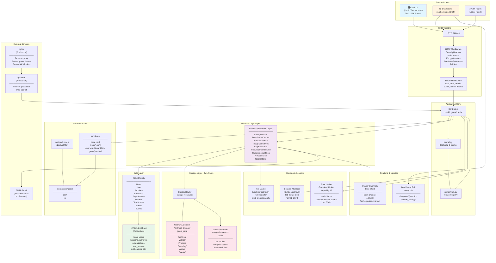

## Request Flow: Editing a News Story

```mermaid
graph LR
    A["Editor POST<br/>/gears/news/1"] -->|Route Match| B["NewsController@update"]
    B -->|Load User| C["LoadSlotUserMiddleware"]
    C -->|Verify CSRF| D["VerifyCsrfToken"]
    D -->|Check Admin| E["AdminMiddleware"]
    E -->|Business Logic| F["NewsService.save_story"]
    F -->|Validate & Sanitize| G["Bleach HTML<br/>Validate Status<br/>Generate Derivatives"]
    G -->|Persist| H["News Model.save"]
    H -->|Write DB| I["MySQL"]
    H -->|Broadcast| J["Pusher editorial<br/>PlayVideo"]
    H -->|Response| K["AjaxResponses<br/>JSON or Redirect"]
    K -->|Result| L["Dashboard<br/>live poll detects change<br/>via stamps"]
    L -->|Auto-refresh| M["AJAX /fragment/news-slots<br/>DashboardContext builds view"]
    M -->|Render| N["Browser updates<br/>news slots panel"]
    
    style A fill:#e1f5ff
    style F fill:#f3e5f5
    style I fill:#e8f5e9
    style N fill:#fff3e0
```

## News Composition & Placement Algorithm

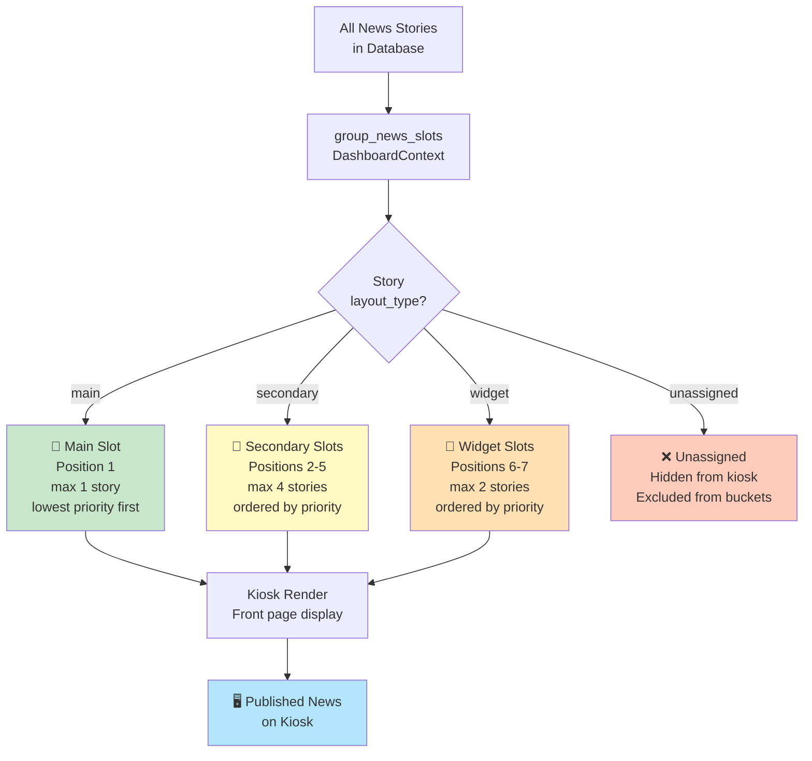

## Editorial Approval Chain

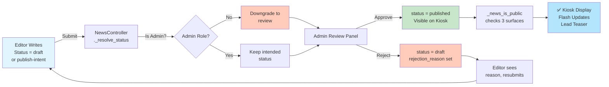

## Storage Routing Architecture

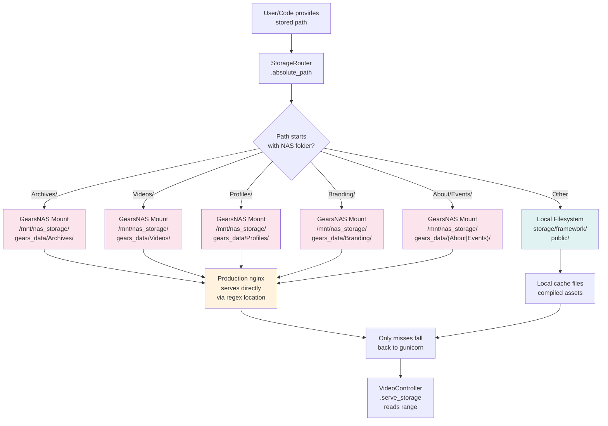

## Campus Map Coordinate System

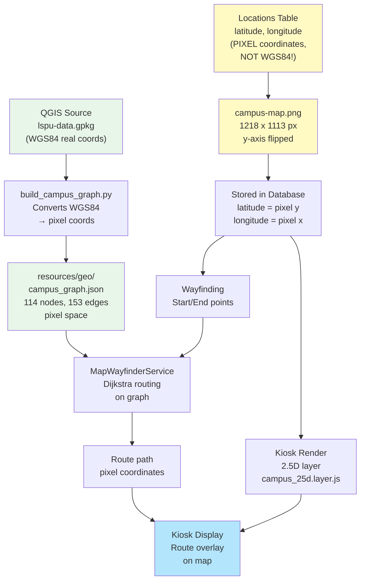

## Virtual Tour Architecture

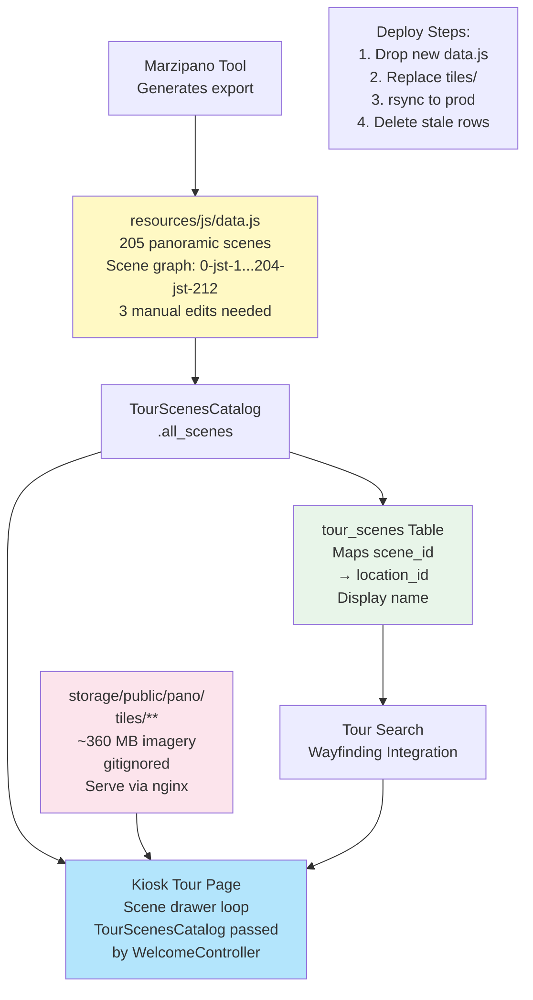

## Organization & Staff Directory Structure

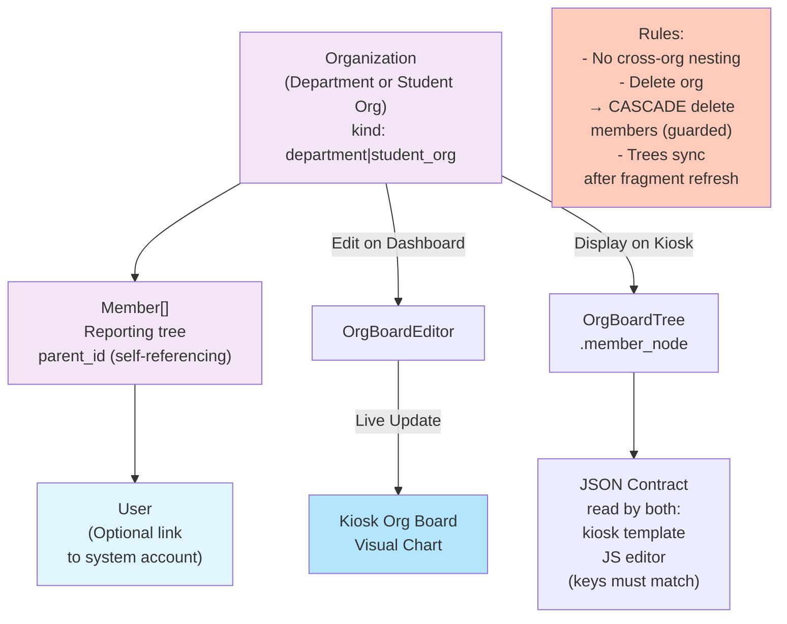

## Multi-Process Safety: Rate Limiting & Caching

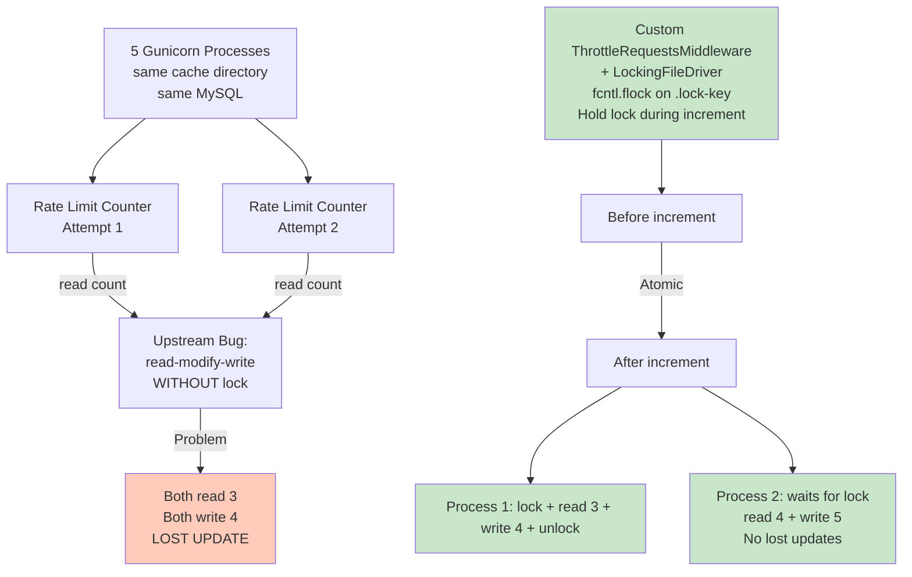

## Frontend Asset Pipeline

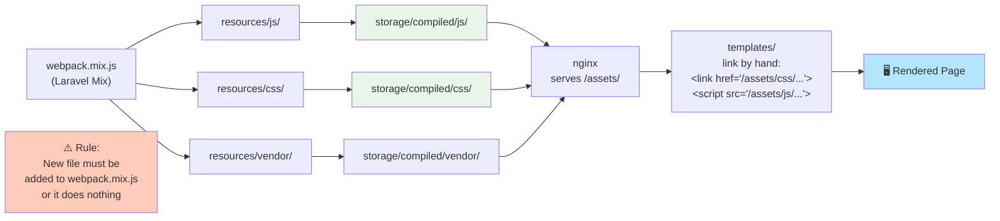

## PDF Archive Processing

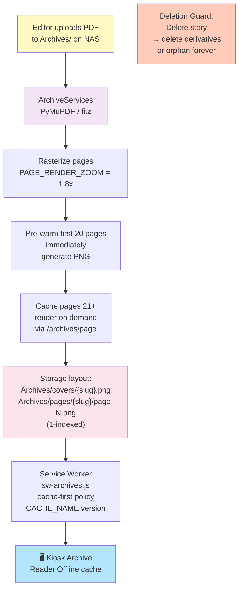

## Dashboard Panel Architecture

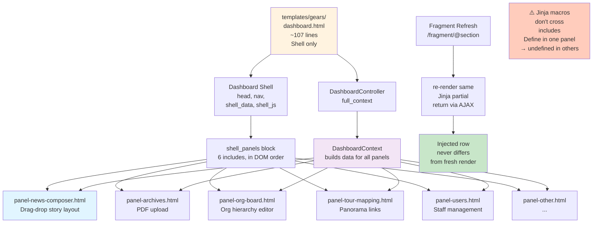

---

## Key Takeaways

1. **Two Audiences, One Codebase**: Kiosk (public) and Dashboard (staff) share all business logic via services
2. **Service Layer Pattern**: Controllers are thin; all logic in `app/services/`
3. **Single Sources of Truth**: `group_news_slots()`, `TourScenesCatalog`, `campus_graph.json` never duplicated
4. **Multi-Process Safety**: File locks on cache, connection reset on every request
5. **Storage Router**: Single resolver for two physical roots (NAS + local)
6. **Pixel Coordinates**: Campus map uses pixels, NOT WGS84 (critical!)
7. **Editorial Chain**: Editors submit → Admins approve/reject → Public visibility
8. **Dashboard Liveness**: 20s poll detects changes via stamp markers, auto-refreshes panels
9. **Fail-Closed Defaults**: Unknown status → draft, missing validation → reject
10. **Production Optimized**: nginx serves static roots directly; gunicorn handles misses only

